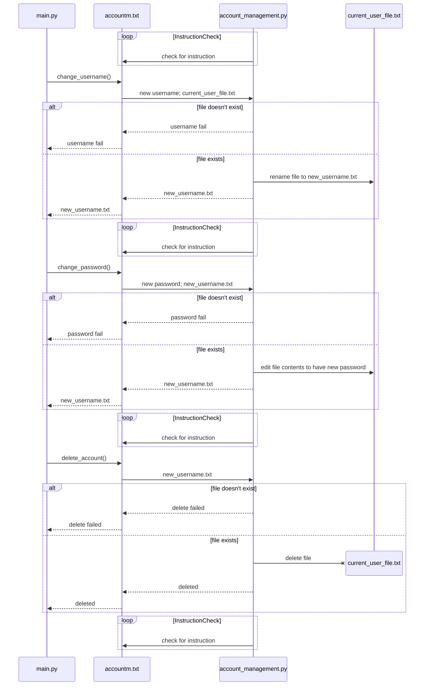

# account-management-microservice
# Requesting actions from account_management.py:
The first line is the command; either "username" to change username, "password" to change password, or
"delete" to delete account.
Second line for username and password commands is the new username/password
Last line is the current user's file
# Examples:

# change username:
username

new_username

old_username.txt

<b>success response:</b>
new_username.txt

<b>fail response:</b>
username fail

# change password:
password

new_password

username.txt

<b>success response:</b>
username.txt

<b>fail response:</b>
password fail

# delete account:
delete

username.txt

<b>success response:</b>
deleted

<b>fail response:</b>
delete failed

